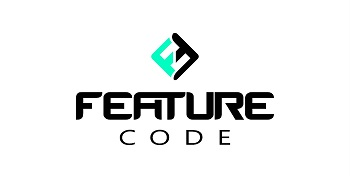

  

    <h1> Site para Portfólio WEB! </h1>

<h3 align = "center">
  Um site One Page que pode servir como Portfólio 🤝🏼
</h3>

<h4 align = "center">
	✅ Portfólio Web 🚀 Versão 1.0 ✅
</h4>

 

 <a href="#visao">Visão geral</a> •
 <a href="#tecnologias">Tecnologias</a> •
 <a href="#conteudos">Conteúdos</a> •
 <a href="#aprender">Como aprender?</a> • 
 <a href="#ajuda">Preciso de Ajuda</a> • 
 <a href="#contato">Contato</a>  

 
 
 
 

<h2> 💡 Visão geral </h2>
Esses arquivos pertencem a uma série de vídeos postada no Youtube com objetivo de ensinar Bootstrap na prática criando um belo e responsivo layout de um site One Page que pode servir como um portfólio. O foco principal é treinar nossas habilidades principalmente no Front-end, e tem caráter educador. 

 
 
 

<h2> 🛠 Tecnologias </h2>
As seguintes ferramentas foram usadas na construção do projeto:  
    - [Bootstrap](https://getbootstrap.com/)  
    - [Node.js](https://nodejs.org/en/) 
    - [Sass](https://sass-lang.com/) 
    - [PopperJs](https://www.npmjs.com/package/popper.js/v/1.14.3) 
    - [JQuery](https://jquery.com/) 

 
 
 

<h2> 🗒️ Quais conteúdos irei praticar? </h2>

Nessa série de vídeos, iremos aprender os seguintes conteúdos:  
-> Instalar o Bootstrap 4 e todas as suas dependências, como PopperJs e JQuery (com Sass e Node); 
-> Criar um layout totalmente responsivo otimizado para todos os tamanhos de aparelhos com Bootstrap 4; 
-> Passo a passo gradual de como você utiliza HTML, CSS e JS com muita facilidade para desenvolver o website; 
-> Utilizar a maioria dos componentes e funcionalidades do Bootstrap tendo a documentação como base; 
-> Criar bonitos e leves efeitos com CSS3 de escala e transição; 
-> Incorporar vídeos e imagens ao seu layout e os deixar responsivos; 
-> Criar um banner animado com muita facilidade e o deixar responsivo; 
-> Criar um formulário de contato com as funcionalidades padrão; 
-> Criar um menu com efeito scrollspy fixo; 
-> Criar efeito de uma imagem de fundo como background fixo; 
-> Incorporar diversas fontes que você desejar usando o Adobe Fonts. 

 
 
 

<h2> 🖊️ Como posso aprender? </h2>

Você pode ter acesso ao tutorial completo desse website acessando a playlist abaixo, junto com várias explicações técnicas das linhas de código que utilizamos e as ferramentas, seguindo um passo a passo completo para a criação do layout inteiro. 

<strong><a href="https://youtube.com/playlist?list=PLDJT6bLhqYO9zhGvvxi1wOzgqNZ3tgMOh" style="background-color: #d22636; color: #fff; padding: 6px; font-weight: 600;"> 🔗 ASSISTIR AO TUTORIAL COMPLETO </a></strong>

 
 
 

<h2> 🔎 Precisa de ajuda?  </h2>

Caso precise de ajuda para acessar os arquivos, ou não esteja entendendo alguma linha de comando utilizada, recomendamos que utilize o espaço disponível para comentários nos vídeos explicativos do projeto que deixei o link acima. 

 
 
 

<h2> 🤝🏼 Como entro em contato? </h2>

Será um prazer entrar em contato com você! Pode escolher qualquer uma das formas abaixo, que entraremos em contato o mais breve possível!

 ** <strong><a href="https://www.linkedin.com/in/t%C3%A9rcio-lu%C3%ADs-martins-ab3992207" style="text-decoration: normal;">  LinkedIn </a></strong>
  
 ** <strong><a href="https://www.instagram.com/featurecode_/" style="text-decoration: normal;">  Instagram </a></strong>
  
 ** <strong><a href="https://featurecode.com.br/contato/" style="text-decoration: normal;">  Formulário de e-mail </a></strong>
  
 ** E-mail direto: <strong>luisnogueira@featurecode.com.br</strong> 

 
 
 
